# DatoCMS Content Diff

Move content between DatoCMS environments, or between duplicated projects, as a
reviewable migration.

> [!WARNING]
> **Beta.** Apply generated migrations to a sandbox first, review every planned
> change, and keep a recovery path before changing content you care about.


`content:diff` compares a **source** environment (the content you want) with a
**destination** (the environment that should receive it) and writes a migration
file plus a detailed plan. Generating reads DatoCMS and writes files locally; it
never changes your project. The migration changes content only when you run it
with `migrations:run`, normally into a fork you can inspect before promoting.

It reproduces records with their current and published versions, nested blocks,
references, uploads and upload collections, publication schedules, tree and
sortable positions, and workflow stages. A record it cannot reproduce exactly is
skipped, reported and left untouched; when skipping cannot be proven safe,
generation stops without writing anything. It never guesses.

## Contents

- [How it works](#how-it-works)
- [Install](#install)
- [Walkthrough: publish a staging release](#walkthrough-publish-a-staging-release)
- [Other workflows](#other-workflows)
- [What gets migrated](#what-gets-migrated)
- [Safety model](#safety-model)
- [Command reference](#command-reference)
- [Commands](#commands)
- [Concurrent runs and the run lock](#concurrent-runs-and-the-run-lock)
- [Interrupting a migration](#interrupting-a-migration)
- [Timeouts](#timeouts)
- [Troubleshooting](#troubleshooting)
- [Limitations](#limitations)
- [Development](#development)
- [Reporting bugs](#reporting-bugs)

## How it works

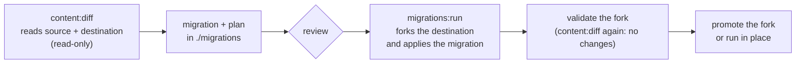

1. **Generate.** `content:diff` checks that both schemas and environment
   settings match, proves it can read every model, captures a consistent
   snapshot of each environment, and computes the smallest safe set of writes.
2. **Review.** The migration file is small; the plan next to it lists every
   create, update, publish, schedule, move and warning.
3. **Apply.** `migrations:run` forks the destination and runs the migration
   there. The migration carries its own versioned runtime, so upgrading the
   plugin never changes how an existing migration behaves. Content migrations
   must be run with this plugin's `migrations:run`.
4. **Validate and promote.** Regenerate the diff against the fork to confirm
   nothing is left to change, check it in the dashboard, then promote it.

## Install

Requirements: Node.js 22.12 or newer and `datocms` 4.x, from 4.2.0 on,
installed in your project. The `npx datocms` examples below use that local
installation.

```bash
npm install --save-dev datocms@^4.2.0
npx datocms plugins:install @datocms/cli-plugin-content-diff
```

To install a local build of this repository instead, from its root:

```bash
npm ci
npm run build
npm pack -w @datocms/cli-plugin-content-diff
npx datocms plugins:install ./datocms-cli-plugin-content-diff-<version>.tgz
```

Every push to a branch of this repository also publishes an installable
preview; see
[Trying a change before it's released](../../README.md#trying-a-change-before-its-released).

Besides `content:diff`, the plugin supplies its own `migrations:new` and
`migrations:run`, because generated content migrations need safeguards the
stock runner does not have. Ordinary migrations keep working as before.

The plugin checks its host every time `datocms` starts. With an unsupported
`datocms` version or a broken installation, `content:diff`, `migrations:new`
and `migrations:run` exit with code 1 and print how to fix it: install a
supported `datocms`, reinstall the plugin, or remove it. The stock migration
commands never run in their place. Other `datocms` commands print one warning
and continue. To go back to the stock commands:

```bash
npx datocms plugins:remove @datocms/cli-plugin-content-diff
```

## Walkthrough: publish a staging release

Everything below was recorded against a demo project: a primary `main`
environment and a `staging` sandbox where an editor prepared a spring release.
The release added a post (with a new hero image) and a changelog entry, edited
and republished a post, changed a price, unpublished a post, scheduled another
to unpublish in two weeks, moved a documentation page to another section, and
deleted a misspelled tag.

### 1. Freeze writes

Ask editors to stop editing and pause integrations that write through the API,
on both environments, until the fork is promoted. Changes made after
generation are not in the migration, and changes made to `main` after the fork
is created are lost when you promote. DatoCMS's maintenance mode
(`npx datocms maintenance:on`, or **Turn on maintenance mode** under
**Project settings > Environments**) blocks editors on the primary environment.

### 2. Generate the migration

```bash
npx datocms content:diff "spring launch" --autogenerate=staging
```


`--autogenerate=SOURCE:DESTINATION` names both environments; leaving out the
destination, as here, targets the primary environment. The output tells you:

- **Files.** The migration (`migrations/<timestamp>_springLaunch.js`), its plan,
  and the runtime it uses, all under your migrations directory.
- **Changes.** How many records and uploads will be created, updated or
  deleted. Publishing, unpublishing, schedules, moves and workflow stages are
  part of those updates.
- **Records and uploads.** Every entity the migration writes, as
  `<model ID>/<record ID> (<title>)`. The title is the record's value for its
  model's presentation title field, in the project's main locale (or the first
  locale that has one); uploads show their filename. To open a record, visit
  `https://<project>.admin.datocms.com/editor/item_types/<model ID>/items/<record ID>`.
- **Warnings.** Here, the deleted tag is kept in `main` because deletions were
  not requested, and one invalid record that already matches `main` is left
  alone.

### 3. Review the plan

The plan (`migrations/.datocms-content/<timestamp>_springLaunch.plan.json`) is
the detailed preview: for every record it holds the destination state it
expects (`baseline`), the state it will write (`desired`), a hash that must
still match at run time (`expectedTargetHash`), and exactly which parts change:

```json
{
  "id": "SYUlstk8RsS0z5qVlEIXSQ",
  "itemTypeId": "15JV9Yw2QDirRL2czxawgw",
  "action": "update",
  "changes": {
    "current": true,
    "lifecycle": false,
    "published": true,
    "schedules": false,
    "stage": false,
    "topology": false
  },
  "expectedTargetHash": "719555f30233129473c63f29760d289c8986ac1f09014e7be0942215b75771c6"
}
```

The plan also records the options used, the schema digest, required
permissions, skipped records with the reason for each, and every warning with a
code (for example `RETAINED_TARGET_RECORD` or `INVALID_CONTENT_NOOP`).

Plans embed content from both environments and source asset URLs, so they can
be large (about 11 MB for this small demo project) and should be treated like a
content export: keep them private, and commit them only where project content
may live.

### 4. Preview, then apply to a fork

```bash
npx datocms migrations:run --destination=content-diff-review --dry-run
npx datocms migrations:run --destination=content-diff-review
```


The dry run lists what would run without changing anything. The real run forks
the primary environment into `content-diff-review`, creates the migrations
tracking model if needed, and runs the migration there in twelve phases, each
printed as it starts:

| Phase | What happens |
| --- | --- |
| 1 | Preflight: permission, schema and environment checks, recovery of an interrupted previous attempt, classification of every planned entity |
| 2 | Upload binaries are downloaded and verified, affected schedules are paused, and any legacy-ID mappings are saved. Exact validator relaxations (only with `--migrate-invalid-content`) are applied right after. |
| 3 | Unique values are released, upload collections reconciled |
| 4 | Uploads created or updated |
| 5 | Missing records created with their planned IDs (temporary default suppression, when planned, wraps this phase) |
| 6 | Tree parents set |
| 7 | Published versions rebuilt |
| 8 | Current (draft) versions and lifecycle metadata restored |
| 9 | Destination-only records unlinked and deleted (only with `--include-deletions`) |
| 10 | Positions and workflow stages finalized |
| 11 | Destination-only uploads pruned (only with `--include-deletions`) |
| 12 | Final state verified against the plan, then schedules restored |

A destination that already matches the plan skips straight to a
verification-only phase 12. The runtime log names the plan's original target
(`staging -> main`) because the fork is a copy of `main`; it applies to
whichever environment `migrations:run` gives it. A dry run lists the pending
files but does not run the migration's preflight, so conflicts only show up in
the real run.

### 5. Verify the result

Regenerate the diff against the fork. A complete migration leaves nothing to
change (warnings about kept or untouched records can remain):

```bash
npx datocms content:diff "verify spring launch" --autogenerate=staging:content-diff-review
```


Delete that verification migration afterwards (it contains no changes). Then
check the fork in the dashboard. Before, in `main`:

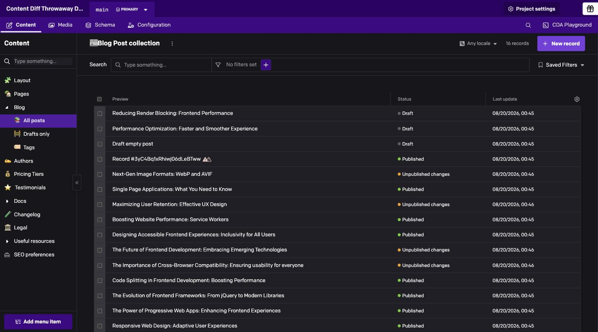

After, in `content-diff-review`: the new post is published, the edited post has
its new title, and the unpublished post is back to draft.

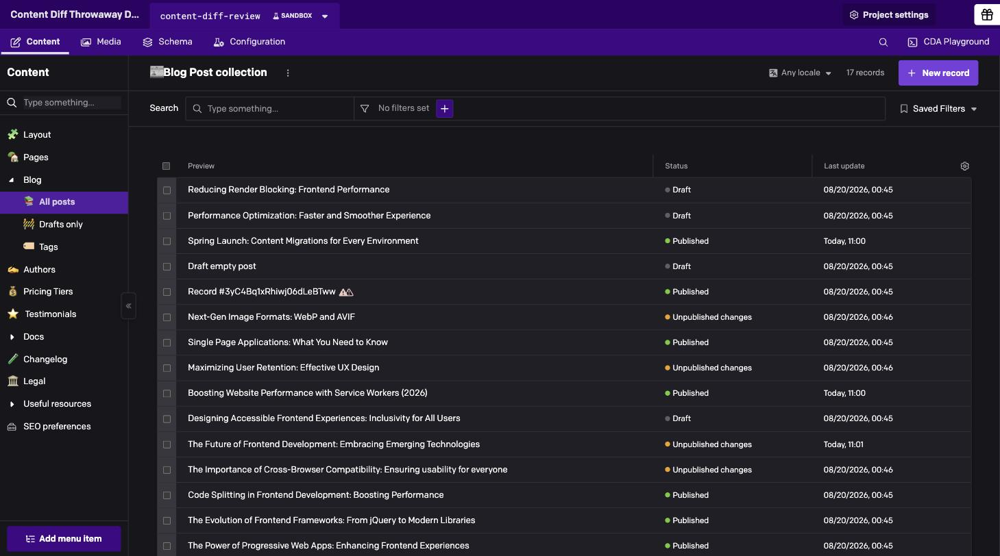

A walk through the fork: the migrated post with its nested image block and
record link intact, the new price, and the documentation page in its new
section.

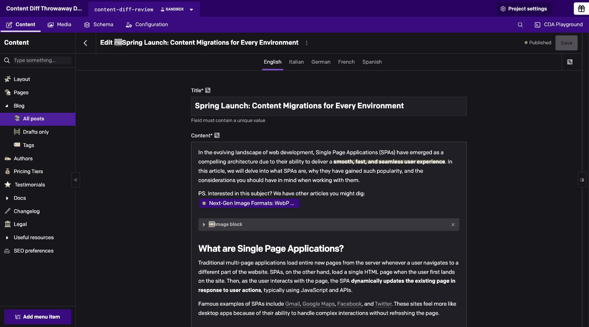

Publication schedules are reproduced too, here the two-week unpublishing
scheduled in `staging`:

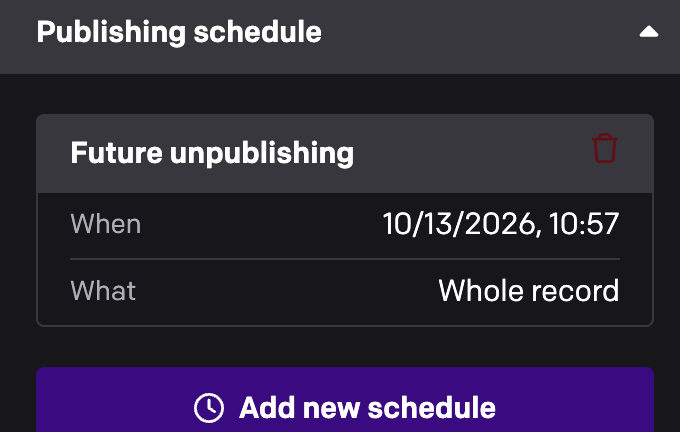

### 6. Promote the fork

When the fork looks right, promote it to primary and lift maintenance mode:

```bash
npx datocms environments:promote content-diff-review
npx datocms maintenance:off
```

Or use **Project settings > Environments**, open the fork's menu, and choose
**Promote**:

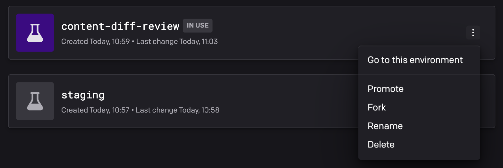

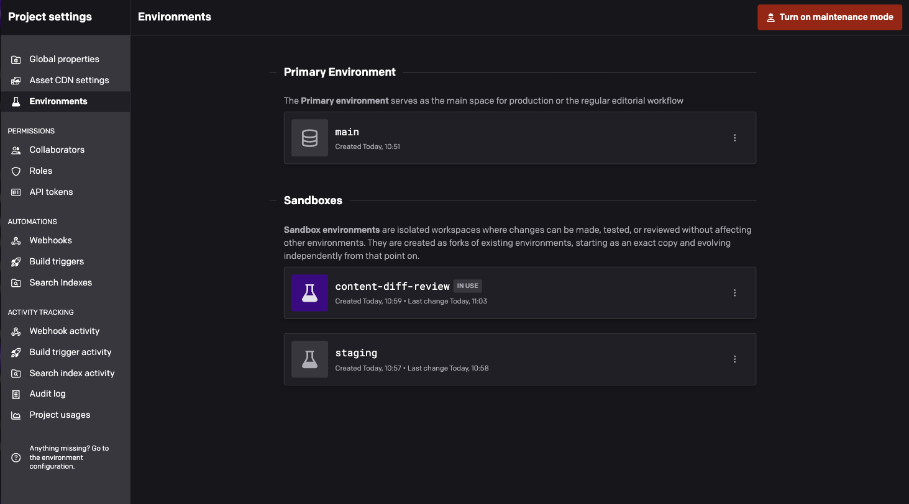

## Other workflows

### Apply directly to the primary environment

After reviewing, you can run the migration in place on primary. Both flags are
required, and there is no automatic rollback if the run fails partway:

```bash
npx datocms migrations:run --in-place --allow-primary --dry-run
npx datocms migrations:run --in-place --allow-primary
```

Prefer promoting a validated fork when your workflow allows it.

### Between two sandboxes

```bash
npx datocms content:diff "sync staging content" --autogenerate=staging:production
npx datocms migrations:run --source=production --dry-run
npx datocms migrations:run --source=production
```

Without `--in-place`, `migrations:run` forks `--source` and applies the
migration to the new fork (name it with `--destination`).

### Across duplicated projects

Two projects duplicated from each other, or from the same starter project, can
be compared when their schemas are aligned. Configure a profile for each and
select both:

```bash
npx datocms content:diff "sync shared content" \
  --source-profile=source_project \
  --destination-profile=destination_project \
  --autogenerate=main:main

npx datocms migrations:run --profile=destination_project --source=main --dry-run
npx datocms migrations:run --profile=destination_project --source=main
```

Omit the destination environment (`--autogenerate=main`) to target the
destination project's primary environment, and then apply with
`--destination=content-diff-review` as in the walkthrough.

- **Shared history is your responsibility.** The plugin verifies model, field,
  workflow and stage IDs, locales, validators, defaults and content settings
  exactly and refuses to run when they differ. It does not map unrelated
  schemas or record IDs. Keep both projects aligned by running the same
  checked-in schema migrations in each; schema autogeneration only works within
  one project.
- **Credentials.** Only generation needs the source project's credentials;
  running needs the destination's only. Prefer OAuth-linked profiles or
  profile token variables. `--source-api-token` and `--destination-api-token`
  exist for automation. `--profile` and `--api-token` cannot be combined with
  the per-side flags, and `DATOCMS_PROFILE` (including one set in `.env`) is
  ignored with a warning.
- **Settings.** The destination profile's migrations directory and tracking
  model are used. Add `--bundle-assets` so new upload files travel with the
  migration instead of being fetched from the source project at run time.
- A copied `datocms_content_diff` ledger that still names another project is
  rejected rather than silently reused.

## What gets migrated

| Content | Behavior |
| --- | --- |
| Records | Created, updated or kept by ID (records with old numeric IDs get new ones, see Legacy IDs). Draft, published and "updated" states are reproduced, including the published version when it differs from the draft. |
| Nested blocks | Modular Content, single blocks, and Structured Text blocks and inline blocks, at any depth, with their IDs. |
| References | Links, Structured Text record links and upload references. Records are created in dependency order; reference cycles are created in stages and completed afterwards. |
| Uploads | Referenced uploads by default, every upload with `--uploads=all`. Binaries and filenames, author, copyright, notes, tags, per-locale alt, title and custom data, focal points, video poster times and collections. New files are fetched from the source URL at run time, or bundled with `--bundle-assets`. Uploads still being scanned or flagged by antivirus, and new files whose names DatoCMS would rewrite (use lowercase ASCII names), stop generation. |
| Schedules | Future publication and unpublishing schedules. |
| Order | Tree parents and sortable positions. When destination-only siblings are kept (no `--include-deletions`), only the relative order is reproduced and the plan warns with `ABSOLUTE_POSITION_NOT_REPRODUCIBLE`. |
| Workflows | Workflow stages. |
| Deletions | Destination-only records and uploads are kept, with a warning, unless you pass `--include-deletions`. Upload collections are never deleted. |
| Invalid content | Invalid records that already match the destination are left alone (`INVALID_CONTENT_NOOP`). Invalid drafts in models that allow saving invalid drafts are copied as they are. Anything else that fails current validators is skipped and reported. With `--migrate-invalid-content` (needs schema-edit permission), eligible records are migrated by temporarily relaxing exactly the failing validators, and creates that would otherwise get new default values keep their empty fields; both are restored afterwards. |
| Legacy IDs | Records, blocks, uploads and collections with old numeric IDs are created under new portable IDs. The mappings are stored in an append-only `datocms_content_diff` model (added to the destination's schema) so later migrations map them consistently. The human output lists every mapping. |
| Schema | Not migrated. Both environments must share the same schema; see [Troubleshooting](#troubleshooting). |

Scope records with `--item-types=post,author`: API keys or IDs of regular
models (blocks follow the records that contain them). Only the selected models'
records are copied, but the schemas of models they link to must still match. A
selected record that links to a record or upload missing from the destination
is skipped (`MISSING_REFERENCE`).

## Safety model

- **Generation is read-only.** Before reading content it checks that schemas
  and environment settings (timezone and product updates) match, proves
  unrestricted read access to every model and to uploads, and refuses
  environments a `migrations:run` is migrating. It then reads each environment
  and re-reads its record, upload and schedule metadata to confirm nothing
  changed while it read (up to three attempts).
- **Every write is checked.** Each record, upload and collection carries the
  destination state it expects, and the run classifies all of them before its
  first write. If any in-scope entity changed after generation, or records
  were added or removed, the run stops in preflight (`TARGET_CONFLICT`,
  `TARGET_SET_CONFLICT`).
- **Skip, never guess.** A record that cannot be reproduced exactly (for
  example a structural change the API cannot express, a unique value held by a
  destination-only record, or a reference cycle it cannot stage) is skipped
  together with everything that depends on it, and reported with a reason.
  Skipped records are left exactly as they are and verified at run time. When
  skipping cannot be proven safe, generation stops instead.
- **Rerun to recover.** If a run stops partway, run the same migration again
  in the same environment (for a fork-mode run, against the fork with
  `--in-place`): it recognizes the writes it already made and continues. A
  finished migration run again makes no changes.
- **Temporary schema changes are restored.** Relaxed validators and suppressed
  defaults are restored before the run ends, even when it fails. Paused
  schedules come back when the same migration is rerun to completion.
- **Bound to its project.** Each migration file carries a binding (target
  project and a checksum of its plan). `migrations:run` refuses a migration
  aimed at another project, or whose plan was edited, before forking.
- **Credentials stay out of output.** Tokens are never written into generated
  files, and `content:diff`, `migrations:new` and `migrations:run` replace them
  with `[REDACTED]` in request logs at every `--log-level` and in error output.

Generated migrations keep their own versioned runtime in
`.datocms-content/runtime-vNN`. Upgrading the plugin never rewrites existing
migrations. Regenerate migrations you have not applied yet to pick up runtime
fixes, and keep older runtime files that applied migrations reference.

## Command reference

### `content:diff NAME`

| Flag | Description |
| --- | --- |
| `--autogenerate=SOURCE[:DESTINATION]` | Required. Environments to compare. Without a destination, the primary environment is used. |
| `--item-types=KEYS` | Comma-separated model API keys (or IDs) to include. Default `all`. |
| `--uploads=referenced\|all` | Uploads referenced by the selected records (default), or every upload. |
| `--include-deletions` | Also delete destination-only records and unused uploads. |
| `--bundle-assets` | Download new upload files next to the migration instead of fetching them from source URLs at run time. |
| `--migrate-invalid-content` | Migrate eligible invalid or historical-null content with exact temporary validator relaxation or default suppression. |
| `--source-profile`, `--destination-profile` | Compare two projects (use both). |
| `--source-api-token`, `--destination-api-token` | Explicit tokens for the two profiles. |
| `--migrations-dir`, `--migrations-model` | Migrations directory and tracking model, resolved like `migrations:run`: flag, then profile `migrations.directory` / `migrations.modelApiKey`, then `./migrations` / `schema_migration`. Pass the same values to both commands. |
| `--ts`, `--js` | Force the migration's language. Default: TypeScript when the profile sets `migrations.tsconfig` or a `tsconfig.json` exists in the current directory or a parent, otherwise JavaScript. |
| `--json` | Machine-readable result: file paths plus change, warning, invalid-content and legacy-ID counts. Warning text, per-record lists and skip reasons are in the human output and the plan. |

Standard flags (`--profile`, `--api-token`, `--config-file`, `--log-level`,
`--log-mode`) work as in the stock CLI. Run `npx datocms content:diff --help`
for the full reference.

### `migrations:run`

The plugin's runner accepts every stock flag and adds:

| Flag | Description |
| --- | --- |
| `--allow-primary` | Required, together with `--in-place`, to run on the primary environment. |
| `--force-unlock=TOKEN` | Clear a stale [run lock](#concurrent-runs-and-the-run-lock) before starting. |

It also validates every pending content migration's binding and plan before
forking, skips the fork when nothing is pending, orders migrations the same way
on every machine, and passes content migrations the execution context they
need. Useful stock flags: `--source`, `--destination`, `--in-place`,
`--dry-run`, `--migrations-dir`, `--migrations-model`, `--migrations-tsconfig`.

### `migrations:new`

Works like the stock command. Its schema autogeneration ignores the internal
`datocms_content_diff` model, and it never overwrites an existing file.

## Commands

The complete flag reference of every command, generated from the plugin.

<!-- commands -->
* [`@datocms/cli-plugin-content-diff content:diff NAME`](#datocmscli-plugin-content-diff-contentdiff-name)
* [`@datocms/cli-plugin-content-diff migrations:new NAME`](#datocmscli-plugin-content-diff-migrationsnew-name)
* [`@datocms/cli-plugin-content-diff migrations:run`](#datocmscli-plugin-content-diff-migrationsrun)

## `@datocms/cli-plugin-content-diff content:diff NAME`

Generate a content migration by comparing two DatoCMS environments

```
USAGE
  $ @datocms/cli-plugin-content-diff content:diff NAME --autogenerate <value> [--json] [--config-file <value>]
    [--profile <value>] [--api-token <value>] [--log-level NONE|BASIC|BODY|BODY_AND_HEADERS] [--log-mode
    stdout|file|directory] [--source-profile <value>] [--destination-profile <value>] [--source-api-token <value>]
    [--destination-api-token <value>] [--migrations-dir <value>] [--migrations-model <value>] [--item-types <value>]
    [--uploads referenced|all] [--include-deletions] [--bundle-assets] [--migrate-invalid-content] [--ts | --js]

ARGUMENTS
  NAME  The name to give to the generated migration

FLAGS
  --autogenerate=<value>           (required) Generate a migration from SOURCE to DESTINATION. When DESTINATION is
                                   omitted, the primary environment is used (for example, --autogenerate=staging or
                                   --autogenerate=staging:production)
  --bundle-assets                  Download upload binaries beside the generated migration instead of transferring them
                                   from source URLs at runtime
  --destination-api-token=<value>  Specify a custom API key for --destination-profile instead of its configured
                                   authentication
  --destination-profile=<value>    Compare and generate for this configured profile (must be used with --source-profile)
  --include-deletions              Include deletion of destination-only records and unused uploads in scope
  --item-types=<value>             [default: all] Item type API keys to include, separated by commas, or "all"
  --js                             Force a JavaScript migration
  --migrate-invalid-content        Migrate eligible invalid or historical-null content with exact temporary validator
                                   relaxation or create-time field-default suppression; unsupported records are skipped
                                   and reported
  --migrations-dir=<value>         Directory where script migrations are stored, resolved like migrations:run (defaults
                                   to the destination profile migrations.directory, then ./migrations)
  --migrations-model=<value>       API key of the DatoCMS model used to store migration data in the destination,
                                   resolved like migrations:run (defaults to the destination profile
                                   migrations.modelApiKey, then schema_migration)
  --source-api-token=<value>       Specify a custom API key for --source-profile instead of its configured
                                   authentication
  --source-profile=<value>         Read content from this configured profile (must be used with --destination-profile)
  --ts                             Force a TypeScript migration
  --uploads=<option>               [default: referenced] Include uploads referenced by selected content or every upload
                                   <options: referenced|all>

GLOBAL FLAGS
  --api-token=<value>    Specify a custom API key to access a DatoCMS project
  --config-file=<value>  [default: ./datocms.config.json, env: DATOCMS_CONFIG_FILE] Specify a custom config file path
  --json                 Format output as json.
  --log-level=<option>   Level of logging for performed API calls
                         <options: NONE|BASIC|BODY|BODY_AND_HEADERS>
  --log-mode=<option>    Where logged output should be written to
                         <options: stdout|file|directory>
  --profile=<value>      [env: DATOCMS_PROFILE] Use settings of profile in datocms.config.js

DESCRIPTION
  Generate a content migration by comparing two DatoCMS environments

EXAMPLES
  Generate a migration from staging to the primary environment

    $ @datocms/cli-plugin-content-diff content:diff "sync staging content" --autogenerate=staging

  Generate a migration from one environment to another

    $ @datocms/cli-plugin-content-diff content:diff "sync content" --autogenerate=source:destination

  Include every upload and destructive cleanup

    $ @datocms/cli-plugin-content-diff content:diff "mirror content" --autogenerate=source:destination --uploads=all \
      --include-deletions

  Migrate eligible invalid or historical-null content using temporary schema changes

    $ @datocms/cli-plugin-content-diff content:diff "sync invalid content" --autogenerate=source:destination \
      --migrate-invalid-content

  Generate a migration across projects that share aligned public IDs

    $ @datocms/cli-plugin-content-diff content:diff "sync shared content" --source-profile=source_project \
      --destination-profile=destination_project --autogenerate=main:main
```

_See code: [src/commands/content/diff.ts](https://github.com/datocms/cli/blob/@datocms/cli-plugin-content-diff@4.2.1/packages/cli-plugin-content-diff/src/commands/content/diff.ts)_

## `@datocms/cli-plugin-content-diff migrations:new NAME`

Create a new migration script

```
USAGE
  $ @datocms/cli-plugin-content-diff migrations:new NAME [--json] [--config-file <value>] [--profile <value>]
    [--api-token <value>] [--log-level NONE|BASIC|BODY|BODY_AND_HEADERS] [--log-mode stdout|file|directory] [--ts |
    --js] [--template <value> | --autogenerate <value>] [--schema <value>]

ARGUMENTS
  NAME  The name to give to the script

FLAGS
  --autogenerate=<value>
      Auto-generates script by diffing the schema of two environments

      Examples:
      * --autogenerate=foo finds changes made to sandbox environment 'foo' and applies them to primary environment
      * --autogenerate=foo:bar finds changes made to environment 'foo' and applies them to environment 'bar'

  --js
      Forces the creation of a JavaScript migration file

  --schema=<value>
      Include schema definitions for models and blocks (TypeScript only). Use "all" for all item types, or specify
      comma-separated API keys for specific ones

  --template=<value>
      Start the migration script from a custom template

  --ts
      Forces the creation of a TypeScript migration file

GLOBAL FLAGS
  --api-token=<value>    Specify a custom API key to access a DatoCMS project
  --config-file=<value>  [default: ./datocms.config.json, env: DATOCMS_CONFIG_FILE] Specify a custom config file path
  --json                 Format output as json.
  --log-level=<option>   Level of logging for performed API calls
                         <options: NONE|BASIC|BODY|BODY_AND_HEADERS>
  --log-mode=<option>    Where logged output should be written to
                         <options: stdout|file|directory>
  --profile=<value>      [env: DATOCMS_PROFILE] Use settings of profile in datocms.config.js

DESCRIPTION
  Create a new migration script
```

_See code: [src/commands/migrations/new.ts](https://github.com/datocms/cli/blob/@datocms/cli-plugin-content-diff@4.2.1/packages/cli-plugin-content-diff/src/commands/migrations/new.ts)_

## `@datocms/cli-plugin-content-diff migrations:run`

Run migration scripts that have not run yet

```
USAGE
  $ @datocms/cli-plugin-content-diff migrations:run [--json] [--config-file <value>] [--profile <value>]
    [--api-token <value>] [--log-level NONE|BASIC|BODY|BODY_AND_HEADERS] [--log-mode stdout|file|directory] [--source
    <value>] [--allow-primary ] [--force [--fast-fork [--destination <value> | --in-place]]] [--migrations-dir <value>]
    [--migrations-model <value>] [--migrations-tsconfig <value>] [--force-unlock <value> | --dry-run]

FLAGS
  --allow-primary                Allow running reviewed migrations in-place on the primary environment. There is no
                                 rollback if the run fails partway through
  --destination=<value>          Specify the name of the new forked environment
  --dry-run                      Simulate the execution of the migrations, without making any actual change
  --fast-fork                    Run a fast fork. A fast fork reduces processing time, but it also prevents writing to
                                 the source environment during the process
  --force                        Forces the start of a fast fork, even there are users currently editing records in the
                                 environment to copy
  --force-unlock=<value>         Clear a stale run lock left by an interrupted migrations:run before starting. Pass the
                                 unlock token printed with the lock error; the lock is cleared only if it still matches.
                                 A killed run may have left the environment partially migrated
  --in-place                     Run the migrations in the --source environment, without forking
  --migrations-dir=<value>       Directory where script migrations are stored
  --migrations-model=<value>     API key of the DatoCMS model used to store migration data
  --migrations-tsconfig=<value>  Path of the tsconfig.json to use to run TS migrations scripts
  --source=<value>               Specify the environment to fork

GLOBAL FLAGS
  --api-token=<value>    Specify a custom API key to access a DatoCMS project
  --config-file=<value>  [default: ./datocms.config.json, env: DATOCMS_CONFIG_FILE] Specify a custom config file path
  --json                 Format output as json.
  --log-level=<option>   Level of logging for performed API calls
                         <options: NONE|BASIC|BODY|BODY_AND_HEADERS>
  --log-mode=<option>    Where logged output should be written to
                         <options: stdout|file|directory>
  --profile=<value>      [env: DATOCMS_PROFILE] Use settings of profile in datocms.config.js

DESCRIPTION
  Run migration scripts that have not run yet
```

_See code: [src/commands/migrations/run.ts](https://github.com/datocms/cli/blob/@datocms/cli-plugin-content-diff@4.2.1/packages/cli-plugin-content-diff/src/commands/migrations/run.ts)_
<!-- commandsstop -->

## Concurrent runs and the run lock

While `migrations:run` applies migrations, it locks the environment it writes
to: the `--in-place` target, or the new fork. The lock is a record with a fixed
ID in the migrations tracking model (`schema_migration` by default), created
before the first script and deleted after the last one.

- Another `migrations:run` against a locked environment exits with
  `MIGRATIONS_RUN_LOCKED` before running anything.
- A fork-mode run will not fork a locked source
  (`MIGRATIONS_RUN_SOURCE_LOCKED`), because the copy could be partially
  migrated. A new fork that inherited a lock is refused
  (`MIGRATIONS_RUN_FORK_COPIED_LOCK`): destroy it and retry later.
- `content:diff` refuses to compare an environment that is being migrated
  (`MIGRATION_RUN_IN_PROGRESS`). To prove no run is in progress it needs read
  access to the tracking model of both environments.
- Dry runs and runs with nothing pending only warn.

The lock never expires. If a run was killed, the lock error shows who held it
(host, process ID, CI job, start time), an unlock token, and the exact command
to clear it, repeating the `--profile`, `--config-file` and `--migrations-*`
flags your run used (add `--api-token` again if you passed one). After
confirming that run is gone:

```bash
npx datocms migrations:run --source=production --force-unlock=<token>
```

The lock is cleared only if it still carries that token, and the command then
runs the pending migrations. Review the environment first: a killed run can
leave it partially migrated.

The lock is advisory: the stock runner and older versions of this plugin ignore
it, and it does not stop editors or other API clients. Creating and deleting it
adds two record events per run on the tracking model, which webhooks listening
to every model receive. It stores the host name, process ID and CI job
identifiers, visible to anyone who can read the tracking model.

## Interrupting a migration

Once `migrations:run` holds its run lock, press **Ctrl-C** (or send SIGTERM)
once to stop safely:

- **Content migrations** (runtime v17 or newer) let the current API request
  finish, restore relaxed validators and suppressed defaults, and stop. Asset
  downloads and processing waits stop at once; an upload already being sent to
  DatoCMS is not cancelled, so stopping can take a moment. Schedules the run
  already paused stay paused until the migration is resumed and completes.
- **Ordinary migrations** and older content runtimes cannot be stopped midway:
  the running script finishes and is recorded, and no further script starts. A
  script can watch `executionContext.abortSignal`, its second argument, to stop
  earlier.
- During a dry run, or before the lock is taken, Ctrl-C ends the command
  immediately.

To resume after an in-place run, rerun the same command. A fork-mode run was
migrating the new fork, so resume there with the command the stop message
prints (for example
`npx datocms migrations:run --source=production-post-migrations --in-place`),
or destroy the fork and rerun the original command.

A **second Ctrl-C** exits immediately without cleanup and prints what may be
left behind: relaxed validators, suppressed defaults, paused schedules, staged
upload files, and the held run lock with the command that clears and resumes.

Exit codes: 130 after SIGINT and 143 after SIGTERM for a clean stop; 1 when an
interrupted content migration also failed to restore its temporary schema
changes; 0 when every pending migration had already finished.

## Timeouts

Upload files are downloaded and verified before the destination changes, so a
failed download leaves it untouched. Five environment variables adjust time
limits; each takes whole milliseconds from 1000 to 86400000 (24 hours). Leave
them unset for the defaults.

| Variable | Default | Controls |
| --- | --- | --- |
| `DATOCMS_CONTENT_DIFF_ASSET_HEADERS_TIMEOUT_MS` | 120000 (2 min) | Waiting for an asset download's response headers. |
| `DATOCMS_CONTENT_DIFF_ASSET_IDLE_TIMEOUT_MS` | 300000 (5 min) | Time a download may receive no data; each chunk restarts it, so large healthy files keep transferring. |
| `DATOCMS_CONTENT_DIFF_UPLOAD_PROCESSING_TIMEOUT_MS` | 600000 (10 min) | Waiting for DatoCMS to process an upload. |
| `DATOCMS_CONTENT_DIFF_VALIDITY_TIMEOUT_MS` | 600000 (10 min) | Waiting for DatoCMS to recompute record validity at the end of a run. |
| `DATOCMS_CONTENT_DIFF_SCHEDULE_SAFETY_WINDOW_MS` | 300000 (5 min) | A schedule the run must pause or restore that is due within this window stops the run. Can only be raised. |

`content:diff --bundle-assets` uses the two download limits and prints a
`Tuning:` line for each non-default value (`tuningOverrides` in `--json`).
Generated migrations read all five where `migrations:run` executes and log
non-default values. Timeout errors name the variable to raise. An invalid
value, including an empty string, stops `content:diff --bundle-assets` before
it reads schema or content, and a migration before its first API request (in
fork mode, after the fork has been created).

## Troubleshooting

**The schemas differ.** Content can only move between environments with the
same schema. `content:diff` stops before reading any content and prints the
commands that bring the destination's schema in line first:


For two projects, apply the same checked-in schema migrations to both instead.

| Error | Meaning | What to do |
| --- | --- | --- |
| `ENVIRONMENT_SEMANTICS_MISMATCH` | Timezone or product-update settings differ, which changes how values are serialized or validated. | Align the settings, or fork the destination from an environment that has them. |
| `UNPROVEN_FULL_ACCESS` | The token cannot prove it reads every model and upload. | Use a full-access token, or a role that reads every model (including the migrations tracking model) and upload in both environments with no creator, locale, stage or collection limits. API tokens also need *Manage upload collections*. The built-in read-only token is not enough. |
| `UNPROVEN_SCHEMA_EDIT_ACCESS` | The plan needs temporary schema changes the token cannot prove it may make. | Use a token that can edit the schema, or drop `--migrate-invalid-content`. |
| `CONCURRENT_SNAPSHOT_CHANGE` | Content changed while it was being read, three times in a row. | Pause editors and integrations, then retry. |
| `MIGRATION_RUN_IN_PROGRESS`, `MIGRATIONS_RUN_LOCKED`, `MIGRATIONS_RUN_SOURCE_LOCKED` | A `migrations:run` holds the lock. | Wait, or clear a stale lock (see [the run lock](#concurrent-runs-and-the-run-lock)). |
| `TARGET_CONFLICT`, `TARGET_SET_CONFLICT` | The destination changed after generation, or records were added or removed. | Delete the stale migration and its plan (it would stay pending and run first), destroy the fork if one was created, and regenerate. |
| `SCHEDULE_TOO_CLOSE` | A schedule the run must pause or recreate is due within the safety window. | For a live destination schedule, cancel it and run again. For a schedule the migration recreates, move it later in the source and regenerate. Letting a destination schedule fire causes `TARGET_CONFLICT`. |
| `MISSING_REFERENCE` (skipped records) | A selected record links to a record or upload the destination lacks and the migration does not create. | Widen `--item-types` or `--uploads`, or create the target first. |
| `UPLOAD_STILL_REFERENCED` | With `--include-deletions`, an upload to delete is still used by records the migration keeps. | Remove those references, or omit `--include-deletions`. |
| "Refusing to overwrite mismatched immutable runtime" | A `runtime-vNN` file in `.datocms-content` differs from this plugin's, because it was edited or came from another build. | Restore it from version control, or regenerate with the build that wrote it. |
| Other skipped records | Records that cannot be reproduced exactly; they stay untouched. | Read each reason in the plan. `--migrate-invalid-content` covers eligible invalid content and unique-value swaps. |

A failed run prints the phases it completed and whether any destination change
was made. Fix the cause and rerun: repeat the command for an in-place run; for
a fork-mode run, run against the fork (`--source=<fork> --in-place`) or destroy
the fork first, since rerunning the original command would try to create it
again. Conflicts need a regenerated migration.

## Limitations

- Requires `datocms` 4.x from 4.2.0 on. Other host versions are refused.
- Content only: schema changes go through ordinary schema migrations.
- Two projects must share their schema history; unrelated projects cannot be
  mapped.
- Unique-value swaps between records need `--migrate-invalid-content`; a
  unique value held by a destination-only record cannot be handed over. Cyclic
  tree creation, moving a block to a different record or field, and deleting
  upload collections are not supported. Affected records are skipped and
  reported.
- Pending content migrations must be run with this plugin's `migrations:run`;
  the stock runner refuses them.
- A hard kill (for example `kill -9` or power loss) can leave relaxed
  validators, paused schedules or the run lock behind until the same migration
  is rerun or the lock is cleared.
- Without `--bundle-assets`, new upload files are fetched from the source
  project's URLs when the migration runs.
- Not tested on native Windows.

## Development

From the repository root:

```bash
npm ci
npm run build
npm test -w @datocms/cli-plugin-content-diff           # offline suite
npm run package:check -w @datocms/cli-plugin-content-diff
```

`package:check` packs the plugin and installs it into a fresh host running the
workspace's `datocms` version. The live suites run against disposable DatoCMS
projects; see [test/e2e/README.md](test/e2e/README.md) and
[test/cross-project-e2e/README.md](test/cross-project-e2e/README.md).

The plugin replaces `datocms`'s own `migrations:new` and `migrations:run`, so
it mirrors their code. `test/compat/host-sources.test.ts` fails whenever that
code changes in `packages/cli`, until the change has been brought into the
plugin as well.

## Reporting bugs

Open a
[GitHub issue](https://github.com/datocms/cli/issues)
with the plugin, DatoCMS CLI and Node.js versions, plus sanitized phase names,
counts, IDs and error codes. **Never attach API tokens, raw content, generated
plans, snapshots or complete API logs.**

## License

MIT, like the rest of this repository. See [LICENSE](../../LICENSE).
